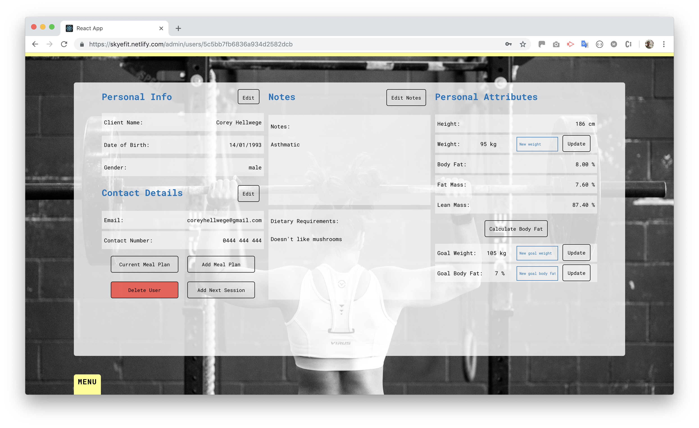

# Skyefit

[github](https://github.com/FeelTheMERN)

[Skyefit](https://skyefit.netlify.com/)

## Description

Skyefit is a web application that aims to provide our client a more convenient experience in managing nutrition, excercise, record keeping and organization. Its main feature is to allow our client to create user accounts, calculate body fat percentage, create meal plans and a calendar that displays booked sessions.

## Tech Stack

* React.js
* Express
* Node.js
* Mongo / Mongoose

## Getting Started

### Installing

We recommend using Homebrew to install some of these prerequisites

Homebrew
```
    $curl-fsSLhttps://raw.githubusercontent.com/Homebrew/install/master/install
```

React
```
    $npm install -g create-react-app
```

Node
```
    $brew install node
```

Mongo
```
    $brew install mongodb
```

It is also required to git clone the front-end and back-end from [github](https://github.com/FeelTheMERN) and run: 
```
    $npm i
```

Furthermore, you must sign-up to [Cloudinary](https://cloudinary.com/) and [Nutritionix](https://developer.nutritionix.com/)

A .env file must be created in the back-end at the root directory with the following environmental variables:

```javascript
    CLOUDINARY_CLOUD_NAME=<cloudinaryName>
    CLOUDINARY_API_KEY=<cloudinaryAPIKey>
    CLOUDINARY_SECRET_KEY=<cloudinarySecretKey>
    JWT_SECRET_KEY=<tokenSecretKey>
    SESSION_SECRET_KEY=<sessionSecretKey>
    REQUEST_ORIGIN=<urlOfDevelopmentWebApp>
    NUTRITIONIX_APP_ID=<nutritionixID>
    NUTRITIONIX_APP_KEY=<nutritionixKey>
    MLAB_URL=<mongodbURL>
```

A .env file must be created in the front-end at the root directory with the following environmental variables:

```javascript
    REACT_APP_NUTRITIONIX_APP_ID=<nutritionixID>
    REACT_APP_NUTRITIONIX_APP_KEY=<nutritionixKey>
```

### Deployment

* Database: [mlab](https://mlab.com/)
* Back-end: [now.sh](https://zeit.co/now)
* Front-end: [netlify](https://www.netlify.com/)

The following files must be included in the back-end root directory: 

now.sh
```
{
    "name": "skyefit",
    "alias": "skyefit",
    "env": {
        "CLOUDINARY_CLOUD_NAME": <cloudinaryName>,
        "CLOUDINARY_API_KEY": <cloudinaryAPIKey>,
        "CLOUDINARY_SECRET_KEY": <cloudinarySecretKey>,
        "JWT_SECRET_KEY": <tokenSecretKey>,
        "SESSION_SECRET_KEY": <sessionSecretKey>,
        "REQUEST_ORIGIN": "https://skyefit.netlify.com",
        "NUTRITIONIX_APP_ID": <nutritionixID>,
        "NUTRITIONIX_APP_KEY": <nutritionixKey>,
        "MLAB_URL": <mlabURL>
    },
    "version": 2,
    "builds" : [
      { "src": "api.js", "use": "@now/node-server" }
    ],
    "routes": [
      { "src": "/(.*)", "dest": "api.js" }
    ]
}
```

The following files must be included in the front-end root directory: 

.env.development
```
    REACT_APP_API_URL=<developmentAPIURL>
```

.env.production
```
    REACT_APP_API_URL=<productionAPIURL>
```

Finally, on both directories we run: 

```
    $npm run deploy
```

## Project

### Summary

As a personal trainer, our client uses a multitude of different services to gain nutritional information, create meal plans, calculate percentage body fat and organize of her bookings. Skyefit aims to bring all these services together, to provide a more convenient and fluid experience for our client.

### Review the conceptual design with the client and edit based on their feedback

### User stories

As admin ISBAT: 
* log in 
* log out
* view all my clients and their details including profile, bookings and meal plans
* generate new users, edit their details and delete a user
* add, edit and delete bookings
* create, edit and delete meal plans for my clients to view on their accounts
* calculate and store data based on the Jackson Pollock skinfold method
* view my dashboard with a calendar which will show upcoming booked sessions
* view nutritional information of desired foods
* filter through my clients

As user ISBAT:
* log in
* log out
* view and edit my profile
* view my personal trainer’s meal plans
* view remaining number of paid/booked sessions
* view my upcoming sessions on a calendar

### Wireframes

[Wireframes](https://www.docdroid.net/OmFX9a5/skyefit-wireframes.pdf)

### Screenshots





### Entity Relationship Diagram (ERD)


### Project plan


### User Flow Diagram


### Data Flow Diagram


### OO design documentation


### Client communication


[Post project review](https://docdro.id/duA9iKJ)

### Testing

[Postman development tests](https://documenter.getpostman.com/view/5936412/RztoNUAN#a1b79b85-0f43-4db4-8e67-cd49d9cfe173)

[Postman production tests](https://documenter.getpostman.com/view/5936412/RztpoRxU)

Automated tests:
```
    $npm run test
```

## Tools & Methodologies

### Agile development methodologies

* Daily morning stand-ups
* Customer Collaboration
* Iterative Development
* User Stories
* SCRUM Meetings
* Programming in Pairs
* Retrospective Meeting

### Code review

Code review was practiced by strictly enforcing team members to merge each other's code. Individual members can not merge their own code to master, but must seek a team member to review their code and provide feedback. This allows for new insight and perspective which can improve code quality.

### Trello


### Slack


## Short Answer Questions

### What are the most important aspects of quality software?

* Identifying and solving user stories
* Continual and automated testing is integral to ensure smooth performance
* Ensure design and framework is robust yet flexible for future changes
* Frequent communication with the client and assessing feedback
* Keeping the code DRY, re-use components as much as possible
* Writing comments when appropriate
* Ensure functions are suitable and accurate, and functions handling sensitive data are secure and compliant to relevant guidelines

### What libraries are being used in the app and why?

* Axios: Provided a more convenient and readable syntax when making HTTP requests
* Body Parser: Important for accessing payloads (req.body) from POST, PUT and DELETE requests
* Bcrypt: Package that hashes passwords before being stored in the database for security
* Cloudinary: Permits users to upload images that is stored in the cloud
* Cookie-session: Allows for cookies which are used for authentication
* Cors: Allows the client to communicate with the API without issue
* Dotenv: Essential for storing sensitive data (keys, secrets) in environmental variables
* Express: Framework for the backend
* JSONWEBTOKEN: Authentication with tokens, an added layer of security on top of cookies
* jwt-decode: Allows the ability to decode the token in the front-end
* Moment: A convenient library for manipulating date formats
* Mongoose: Used to generate models which interacts with the database
* Multer: Allows for temporary in-memory storage before uploading to Cloudinary
* Nodemon: Convenient dev package that restarts the server when alterations are made
* Now: We used now.sh to deploy our backend application
* Passport: Important middleware responsible for authenticating username and password

### A team is about to engage in a project, developing a website for a small business. What knowledge and skills would they need in order to develop the project?

For a team to succesfully develop a web app, there are many things to consider, from staff to skills to job requirements.

Paramount amongst these concerns are the needs of the client. What are their needs? Can your team deliver a solution in the form of a viable product? Is so, how long will the project take? And, how much will it cost?

For the designers and developers, they must think of the project in terms of the web app's features and functions  and the hard skills, tools and resources required.

Besides technical know-how, the project requires staff with project management and people (soft) skills, some of the roles include leadership, delegating tasks, determining budgets and timelines marketing, managing tasks and risks, and ongoing communication with the team and clients/stakeholders.

Agile methodologies are a common approach to project management that is commonly utilised by the tech industry.

Below is a list of some (but not limited to) key skills required to develop a web app.

Technical Skills:

* HTML/CSS: Builds the skeleton of a website (the layout) and the style and look
* Programming Language/s (Javascript, Ruby, PHP, Python etc.): Makes websites and applications more interactive and functional
* Web Development Frameworks (Rails, Node etc.): Resources and tools for developers to build and manage web applications, web services and websites. A framework includes templating for presenting information within a browser, a programming environment for scripting the flow of information and an API for accescing underlying data resources
* Design and Planning Software (Adobe suite - Photoshop, Illustrator, Trello etc.): Design, edit and stylise the look of websites; plan and create mockup websites, experiment and visually communicate concepts with clients, and team members
* Responsive Design: Create websites for optimal user experience. More and more consumers user their mobile devices for online searches. If websites aren't compatible with mobile devices, they display and function poorly, increasing the likelihood of users clicking away from the site
* Content Management Systems (Wordpress etc.): Easy to use, cms allow developers to edit and modify web pages, add plugins, and run tests for bugs and features for SEO. (in some cases, a cms would be a suitable solution.)
* Search Engine Optimisation (SEO): Essential for website marketing and visibility, SEO attracts traffic and secure leads, connecting products and consumers
* Version Control/Git: A system that records changes to a file or set of files over over time so that a specific version can be recalled later
* Testing/Debugging: Testing is a process of finding bugs or errors in a software product that is done manually by tester or can be automated. Debugging is a process of fixing the bugs found in testing phase
* Command Line: An itegral tool, mastering the command line enables developers to fulfill tasks quicker and automate with special commands that loop through and perform the same action on many files — saving loads of time in the process
* Browser Development Tools: Enable developers to do things such as executing and debugging JS snippets, inspecting and editing DOM elements, monitoring real-time network traffic as the web page loads to identify bottlenecks, analysing CSS performance, ensuring your code is not using too much memory or too many CPU cycles

Soft Skills:
* Communication
* Team work
* Analytical thinking
* Self-Motivation
* Creativity

Project Management:
* Leadership
* Scheduling (Time management)
* Risk Management
* Task Management
* Quality Management

Agile Methodologies:
* Daily morning stand-ups
* Customer Collaboration
* Iterative Development
* User Stories
* SCRUM Meetings
* Programming in Pairs
* Retrospective Meeting

### Within your own project what knowledge or skills were required to complete your project, and overcome challenges?

* Familiarity with the terminal
* Understanding how React behaves in terms of components, props, states and life cycles
* The ability to hit certain APIs and using environmental variables
* A grasp in Express and familiarity with endpoints and HTTP methods
* An understanding in JavaScript: data types, data structures, functions and asynchronous functions
* Basic knowledge of MongoDB and document data format especially JSON
* Deployment: 
    - Database: MLAB
    - Front-end: Netlify
    - Back-end: Now.sh
* Creating user stories and implementing functionality based on them
* Adopting agile methodologies
* Consistent and thorough code reviews
* Using libraries when required
* Soft-skills that include communication, team work and leadership
* Continous communication with the client
* Code/peer review
* Manual and automated testing
* Project management, especially effective time management

### Evaluate how effective your knowledge and skills were this project, using examples, and suggest changes or improvements for future projects of a similar nature?

The skills and knowledge aforementioned were sufficient to make the web app however, there were definitely improvements that could have been made: 

* Further refactoring and DRY code
* Plan more realistically, we were a little ambitious considering the time contraint
* More automated testing to ensure a smooth experience for the client and users
* Comment appropriately when required
* Adopting more agile methodologies

## Further Development

The following features are being considered to be implemented: 

* Recording users' excercise routine
* Payment system
* A chart system to visualize progress
* Improve user interface through CSS
* Further refactoring code

## Authors
* [Lili](https://github.com/lilianamolloy)
* [Simon](https://github.com/Simon-Truong)
* [Corey](https://github.com/coreyhellwege)
* [Mat](https://github.com/mathewwatts)